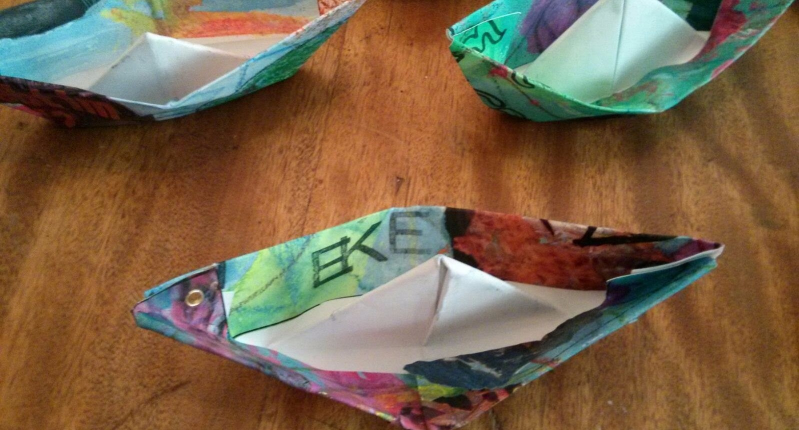

# Wer wir sind

Erwachsene Kriegsenkel sind eine Gemeinschaft von Frauen und Männern, die aufgrund der Traumatisierungen ihrer Eltern, die als Kinder den 2. Weltkrieg und/oder Diktatur, Verhaftung und Gefängnis in der Nazizeit, der SBZ, der DDR und/oder Flucht/Vertreibung erlebt haben und deshalb in ihrer Herkunftsfamilie nicht die Liebe und Zuwendung bekommen haben, die für unsere angemessene Entwicklung notwendig gewesen wäre. Es geht uns in der Gruppe um die Aufarbeitung der transgenerational weitergegebenen Traumafolgen in dysfunktionalen Gesellschaften bzw. Familiensystemen.

Indem wir gemeinsam lernen, über das in unserer Herkunftsfamilie Unausgesprochene zu reden, erforschen wir Facetten unserer traumatisierten Familiengeschichte und machen diese verborgenen Facetten einer Bearbeitung und schließlich Integration zugänglich. In der Gruppe sprechen wir ausschließlich von unserer eigenen Geschichte. Wir geben keine Ratschläge und bewerten die Erfahrungen Anderer in der Gruppe nicht. Jeder ist für sich selbst verantwortlich nach dem Grundsatz: nimm mit, was Du verwenden kannst und lasse den Rest liegen.

Unser wichtigstes Anliegen ist es, uns vom Schmerz der Vergangenheit zu lösen und nicht länger die unbestimmte Last unserer Eltern tragen zu müssen. Vielmehr wollen wir in der Gruppe lernen, ein erfülltes Leben zu führen und unsere Botschaft an andere Kriegsenkel weiter zu geben, die noch leiden.
Wir stehen in der Tradition anderer 12 Schritte Gruppen, z.B. der [Erwachsenen Kinder aus suchtkranken Familien](http://www.eksev.org) und verwenden für unsere Gruppe Literatur und Meetingsstruktur, die in dieser Gemeinschaft entwickelt wurden.

Obwohl wir eine separate Gruppe sind, möchten wir immer mit anderen Gruppen, die das 12 Schritte Programm praktizieren, zusammen arbeiten.

Link zur [Arbeitsmappe](ArbeitsmappeEKE.pdf)

Wir treffen uns jeden 2. Freitag im Monat von 19 bis 21 Uhr in Köln
in der IDL e.V., Saarstrasse 22, 50677 Köln.

Kontakt: [email](mailto:eke.freitag.koeln@gmail.com)
